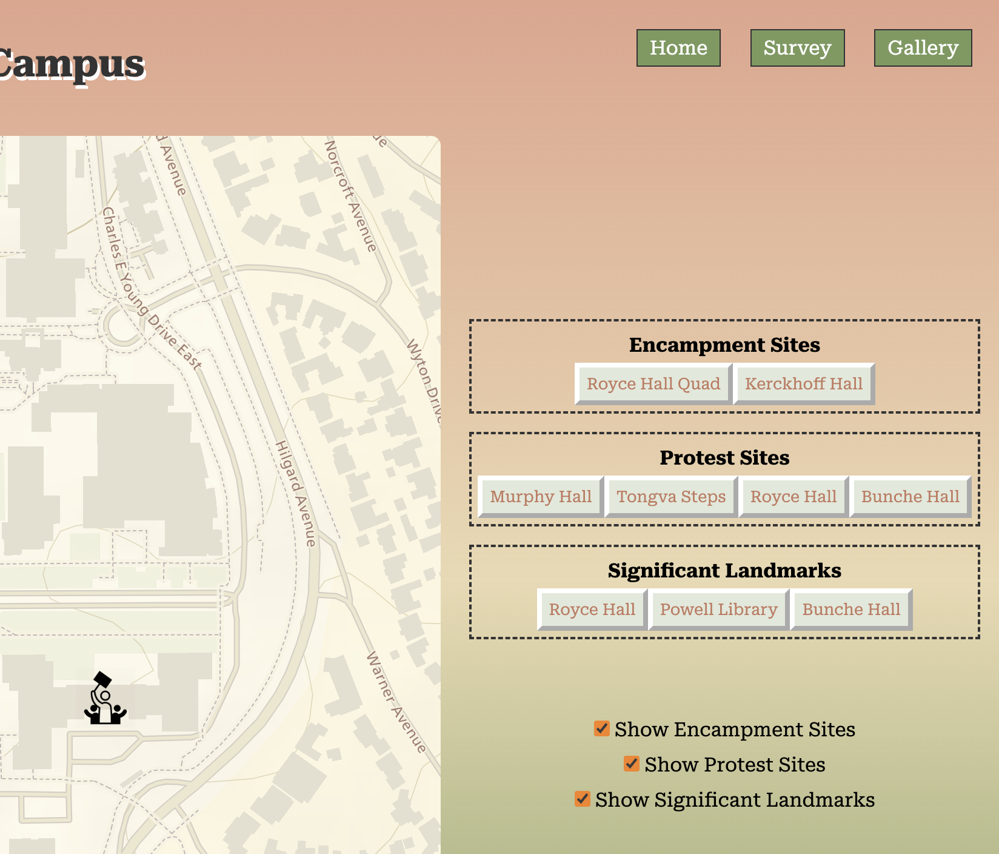
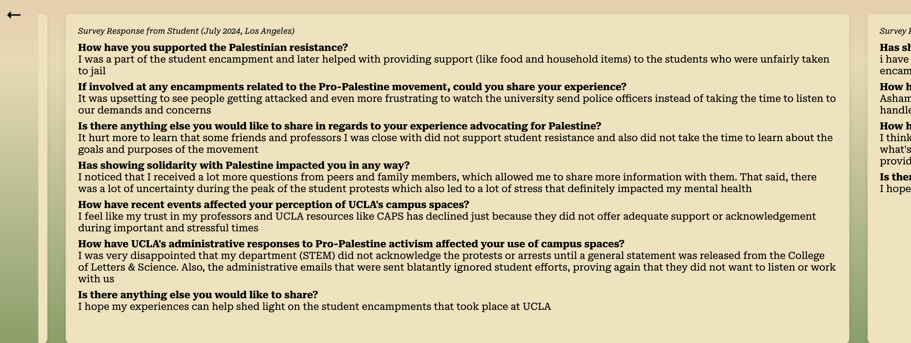
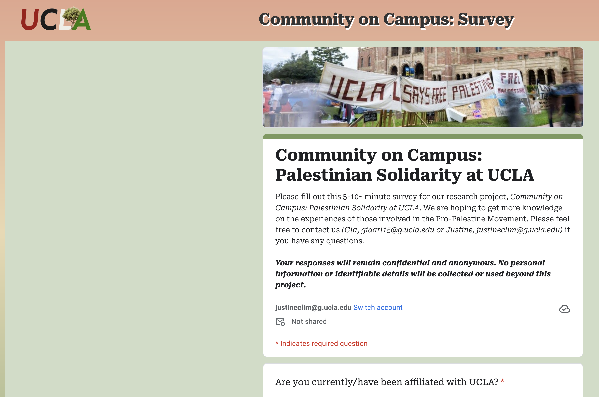

# Community on Campus: Palestinian Solidarity at UCLA
> A web-based mapplication dedicated to documenting and amplifying the voices and experiences of those involved and impacted by the Pro-Palestine movement on campus.
> Use it [_HERE!_](https://stinest.github.io/24su-191a-group4/mapplication/index.html)

## Table of Contents
* [Objective](#objective)
* [Target Audience](#who-is-being-empowered)
* [Technologies Used](#what-technology-was-used)
* [Community Uses](#how-can-it-be-repurposed)
* [About Our Mapplication](#meet-our-mapplication)
* [Contact](#contact-information)

## Objective
On October 7th, the ethnic cleansing of Palestinians became front page news, entering the focus of people worldwide since Hamas' armed uprising against Israel. Israel and the Western Empire's response to commit a horrific escalation of genocide led to public outcry and a call to action in solidarity with Palestine around the world. Students across college campuses were (and still remain) at the forefront of advocating for Palestine, supporting the resistance by building encampments, liberated zones, and communes. These students and community members have faced a media war, academic and political repression, and semblances of actual war with brutalization of protesters by police. 

Specifically at UCLA, students, faculty, and community members have faced repression by universities and the Los Angeles City government. At UCLA, administration chose to deploy campus police and security (LAPD, LASD, and CHP) onto peaceful protestors and have put in place a range of disciplinary actions for students and faculty, and have conducted processes to hold onto diplomas. In the face of legal procedings, disciplinary hearings, and the general exploitative nature of media coverage, students have been abstaining from publically speaking on their experiences with solidarity encampments outside of collective fronts. Our project aims to cement into public memory the creation, sustenance, and brutalization of and onto the Palestinian cause that took shape in encampments and liberated zones at UCLA. In doing this, we hope to uplift the UCLA community by inspiring students and increasing community involvement!

## Who is Being Empowered?
We want to provide a safe space for the UCLA community, involving everyone who has been affected by the recent Pro-Palestine movements on campus. By creating a place where the direct voices of the people that have faced academic and political repression will be heard, we hope to consolidate the thoughts and feelings of the Pro-Palestine movement outside the algorithms and ocean of social media. 

## What Technology Was Used?
Our mapplication is a web-based tool created to collect and visualize user-submitted experiences related to the Pro-Palestine movement at UCLA. Developed using HTML/CSS and JavaScript, the site also serves as an image gallery with photos taken during the movement, in addition to being a platform for submitting responses.

Data is submitted through an online Google Form embedded in the mapplication and provides detailed (and secure) information about their involvement and experience. Using MapLibre, we visualize these submissions on an interactive map which allows visitors to see the geographic distribution of activities and significant locations related to the Pro-Palestine movement. The data is frequently updated to reflect changes and updates and provides an accurately evolving view of the movement's impact.

## How Can It Be Repurposed?
By visualizing the Pro-Palestine movement, activists and organizations can identify patterns and locations that hold significance. This can help better plan and coordinate future actions. Additionally, this tool provides valuable data that can be studied to better understand the impact of social and political issues on universities.

## Meet Our Mapplication!

* Buttons on the map's right side allow easy navigation to markers organized by location type.

* A carousel displays responses for a deeper understanding of community experiences.

* Participate in the survey directly on the mapplication.

## Contact Information
Created by Gia Kim (giaari15@g.ucla.edu) and Justine Lim (justineclim@g.ucla.edu)
Please feel free to contact us if you have any questions!
